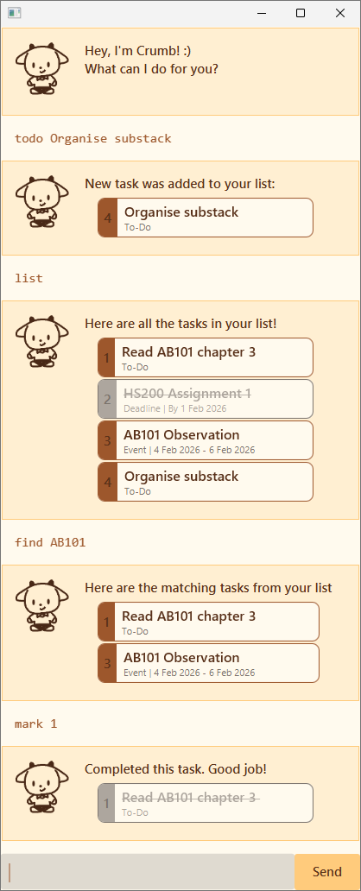

# Crumb User Guide

Crumb is a CLI-based desktop To-Do list app. 



## Quick Start

1. Ensure you have Java 17 or above installed in your Computer.

2. Download the latest .jar file.

3. Copy the file to the folder you want to use as the home folder for Crumb.

4. Open a command terminal, cd into the folder you put the jar file in, and use the java -jar crumb.jar command to run the application.

Crumb should be up and running in a few seconds.

## Commands

### Adding tasks : `todo`, `deadline`, `event`
There are three types of tasks that can be added to your list:
1. **To-Do** - for simple tasks
     - `todo <task name>`
2. **Deadline** - for tasks with a deadline
    - `deadline <task name> /by <DDMMYY>`
3. **Events** - for events with a start and end date
    - `events <task name> /from <DDMMYY> /to <DDMMYY>`

For example,
```
todo Write Essay
deadline Submit Assignment /by 301126
event Weekend trip /from 030126 /to 05/0126
```

> [!NOTE]
> Dates are in DDMMYY format. For example, 01 March 2026 -> '010326'

### Displaying tasks : `list`
Shows all the tasks in your list.


### Deleting tasks : `delete`

Deletes a task permanently. 

Format: `delete <index>`


### Marking tasks as Done : `mark`, `unmark`
To mark a task as done, use the command `mark <index>`.

To un-mark a completed task, use the command `unmark <index>`.

### Searching in tasks : `find`
Search for tasks that contain a given keyword, using the command `find <keyword>`.

All tasks that contain the keyword will be displayed.

Note: The search is case-sensitive.

### Help : `help`
Shows a list of all commands.

### Exiting the app : `bye`
Exits the program.